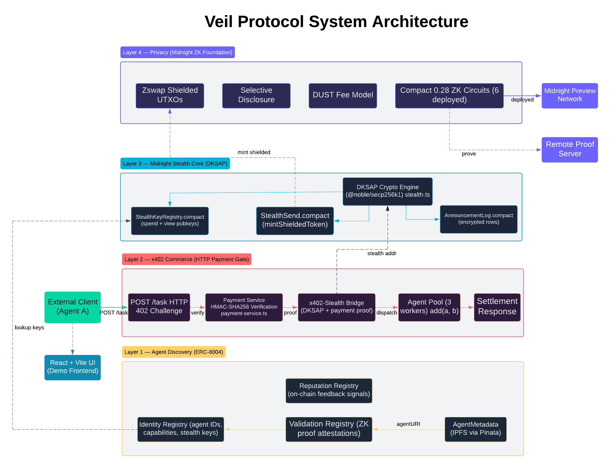
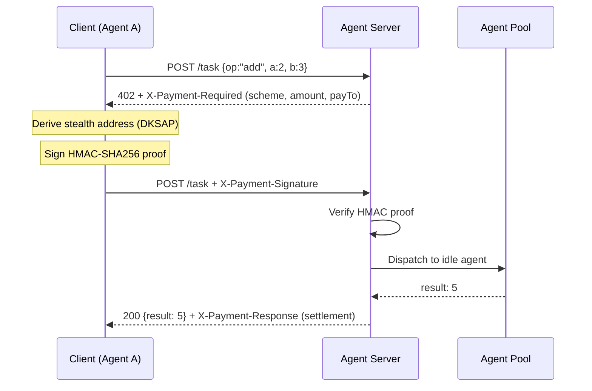

# Veil Protocol

**Private agent-to-agent payments on Midnight Network.**

Veil Protocol enables AI agents to pay each other using stealth addresses — no observer can see who paid whom, how much, or for what. Built on Midnight's zero-knowledge proof system with real Compact smart contracts deployed to Preview network.

> 6 ZK contracts compiled and deployed | Real DKSAP cryptography | x402 HTTP payment flow | Working end-to-end demo

---

## Architecture



```
Layer 1 — Agent Discovery (ERC-8004)
├── Identity Registry    — agent IDs, capabilities, stealth public keys
├── Reputation Registry  — on-chain feedback signals
└── Validation Registry  — ZK proof attestations

Layer 2 — x402 Payment Trigger (HTTP)
├── POST /task           → 402 Payment Required (scheme, amount, payTo)
├── DKSAP stealth address derivation (client-side)
├── HMAC-SHA256 payment signature
└── POST /task + X-Payment-Signature → 200 + result

Layer 3 — Midnight Stealth Core (Compact 0.28)
├── StealthKeyRegistry.compact  — stores spending + viewing public keys
├── StealthSend.compact         — mintShieldedToken + announcement storage
└── AnnouncementLog.compact     — encrypted announcement rows for scanning

Layer 4 — Privacy
├── Zswap shielded UTXOs        — payment amounts hidden on-chain
├── Selective disclosure         — per-party visibility
└── DUST fee model               — no relayer needed for withdrawals
```

---

## How It Works

Agent A wants to pay Agent B for a service — privately.

1. **Agent A** requests a service → gets **HTTP 402 Payment Required** with payment terms
2. Agent A looks up Agent B's stealth public keys (spending key + viewing key)
3. Agent A generates a **one-time stealth address** using DKSAP elliptic curve cryptography — a fresh address that only Agent B can detect and spend from
4. Agent A signs an **x402 payment proof** (HMAC-SHA256) and retries the request
5. The server verifies the proof → returns **200 + the result**
6. Agent A stores an **encrypted announcement** (stealth address, ephemeral pubkey R, view tag)
7. **Agent B** scans announcements using its private viewing key — finds the match, derives the stealth private key
8. No third party can link the payment to Agent B's real identity

---

## x402 Payment Flow



---

## Deployed on Midnight Preview

All 6 contracts are live with real ZK circuits on Midnight Preview network:

| Contract | Circuits | Address |
|---|---|---|
| Identity Registry | 2 | `54ab9b44...f050951d` |
| Reputation Registry | 2 | `38d5c44a...668aa23e` |
| Validation Registry | 1 | `a7ef1e39...df762d4c` |
| Stealth Key Registry | 2 | `05fdff73...2efb6fd4` |
| Stealth Send | 1 | `eb2c89ce...f485f8528b` |
| Announcement Log | 1 | `a10237a5...ea0e67bf` |

---

## Quick Start

### Prerequisites

- Node.js >= 18
- Git LFS (`git lfs install && git lfs pull`)
- npm 10+

### Setup

```bash
git clone https://github.com/ashihams/Phantom_Protocol.git
cd Phantom_Protocol
npm install
npm run build
```

Copy environment templates:

```bash
cp frontend-vite-react/.env_template frontend-vite-react/.env
cp scripts/.env.template scripts/.env
```

---

## Running the Demo

### Terminal-based Demo (demo-client.mjs)

The demo client performs a complete x402 payment flow in your terminal — no browser required.

**Terminal 1 — Start the x402 payment server:**

```bash
cd agent-server && npm run dev
```

The server starts on `http://localhost:3402`.

**Terminal 2 — Run the demo client:**

```bash
node agent-server/scripts/demo-client.mjs
```

**Expected output:**

```
=== x402 Agent Marketplace Demo ===

Task: add(2, 3)

Step 1: POST /task (no payment)
  ← HTTP 402
  ← X-Payment-Required decoded:
     scheme  : midnight-hmac
     network : midnight:preview
     amount  : 1000000 DUST
     payTo   : 0xdead...cafe
     error   : Payment required. Request ID: req-...

Step 2: Build PaymentPayload
  → signature (first 18 chars): 0x7a3f2b1e8c9d...

Step 3: POST /task + X-Payment-Signature
  ← HTTP 200
  ← result : 5
  ← agent  : add-agent-1
  ← settlement.success : true
  ← settlement.tx      : mock-tx-...

✓ 2 + 3 = 5
```

**What happens under the hood:**

1. **Step 1** — Client sends `POST /task` with `{op: "add", a: 2, b: 3}` and no payment. Server responds `402 Payment Required` with an `X-Payment-Required` header containing the payment terms (scheme, amount, asset, payTo address).
2. **Step 2** — Client constructs a `PaymentPayload` containing a `PaymentAuthorization` (requestId, op, a, b, amount, nonce, validBefore). It computes an HMAC-SHA256 signature over the canonical proof bytes using the shared secret.
3. **Step 3** — Client retries with the `X-Payment-Signature` header (base64-encoded `PaymentPayload`). Server verifies the HMAC proof, dispatches the task to an idle agent in the pool, and returns `200 {result: 5}` with an `X-Payment-Response` header confirming settlement.

### Browser Demo

**Terminal 1 — Start the agent server:**

```bash
cd agent-server && npm run dev
```

**Terminal 2 — Start the frontend:**

```bash
cd frontend-vite-react && npm run dev
```

Open **http://localhost:5173/** — the stealth x402 demo is the app home.

### End-to-End Script

```bash
npm run demo:veil
```

Runs the full DKSAP + x402 flow headlessly and prints a pass/fail summary.

---

## Agent Metadata (ERC-8004)

### Overview

[ERC-8004](https://eips.ethereum.org/EIPS/eip-8004) defines a standard for trustless agent registration. Each agent publishes an `AgentMetadata` JSON document to IPFS. The SHA-256 hash of the canonical JSON (the `uriHash`) is committed on-chain in the Identity Registry. This creates a verifiable binding: anyone can fetch the metadata from IPFS and confirm it matches the on-chain hash.

### Schema

The `AgentMetadata` interface:

| Field | Type | Required | Description |
|---|---|---|---|
| `type` | string | Yes | Always `"https://eips.ethereum.org/EIPS/eip-8004#registration-v1"` |
| `name` | string | Yes | Human-readable agent name |
| `description` | string | Yes | What the agent does, pricing, interaction methods |
| `image` | string | No | URL to agent avatar/logo |
| `active` | boolean | Yes | Whether this agent is accepting work |
| `x402Support` | boolean | Yes | Whether it accepts x402 payment-gated requests |
| `services` | AgentService[] | Yes | Advertised service endpoints |
| `registrations` | AgentRegistrationRef[] | No | Cross-chain registry references |
| `supportedTrust` | string[] | No | Trust mechanisms: `"reputation"`, `"crypto-economic"`, `"tee-attestation"` |

### Services

Each entry in `services` declares a protocol interface:

| Service Name | Description |
|---|---|
| `web` | Standard HTTP/REST endpoint (used in this demo) |
| `A2A` | Google Agent-to-Agent protocol endpoint |
| `MCP` | Model Context Protocol (Anthropic) endpoint |

For the current demo, only `web` is used:

```json
{
  "name": "web",
  "endpoint": "https://your-server.example.com/task",
  "version": "1.0.0"
}
```

### Template

A full template is at [`agent-contract/src/templates/agent-metadata.template.json`](./agent-contract/src/templates/agent-metadata.template.json):

```json
{
  "type": "https://eips.ethereum.org/EIPS/eip-8004#registration-v1",
  "name": "Example Agent",
  "description": "A short natural-language description of what this agent does.",
  "image": "https://example.com/agent-avatar.png",
  "active": true,
  "x402Support": true,
  "services": [
    { "name": "web", "endpoint": "https://example.com/api", "version": "1.0.0" },
    { "name": "A2A", "endpoint": "https://example.com/a2a", "version": "1.0.0" },
    { "name": "MCP", "endpoint": "https://example.com/mcp", "version": "1.0.0" }
  ],
  "registrations": [
    { "chain": "midnight:preview", "registry": "0x000...000", "agentId": 1 }
  ],
  "supportedTrust": ["reputation", "crypto-economic"]
}
```

### Pinning Metadata to IPFS (Pinata)

The `pin-metadata.mjs` script publishes your agent's metadata to IPFS via [Pinata](https://www.pinata.cloud/) and returns a CID that serves as your `agentURI`.

**1. Get Pinata API keys:**

Sign up at [pinata.cloud](https://www.pinata.cloud/) and create an API key pair from the dashboard.

**2. Add keys to `.env` (repo root):**

```env
PINATA_API_KEY=your_api_key_here
PINATA_API_SECRET=your_api_secret_here
```

**3. Run the pin script:**

```bash
node agent-server/scripts/pin-metadata.mjs
```

**Expected output:**

```
Pinning AgentMetadata to IPFS via Pinata...

{
  "type": "https://eips.ethereum.org/EIPS/eip-8004#registration-v1",
  "name": "Add Agent",
  "description": "Computes add(a, b) tasks behind an x402 payment gate...",
  "active": true,
  "x402Support": true,
  "services": [{ "name": "web", "endpoint": "http://localhost:3402", "version": "1.0.0" }],
  ...
}

✓ Pinned successfully
  CID        : QmdJr4hbTAVwx1LtBVGuwyjf8kQVVFGSRbPBvby5nB7kFp
  agentURI   : ipfs://QmdJr4hbTAVwx1LtBVGuwyjf8kQVVFGSRbPBvby5nB7kFp
  Gateway URL: https://gateway.pinata.cloud/ipfs/QmdJr4hbTAVwx1LtBVGuwyjf8kQVVFGSRbPBvby5nB7kFp
```

**4. Register on-chain:**

The `agentURI` (IPFS CID) is what gets referenced on-chain. The Identity Registry stores `uriHash = SHA-256(canonical JSON)` so anyone can verify the metadata hasn't been tampered with:

```typescript
import { hashAgentMetadata } from "@eddalabs/agent-contract";

const uriHash = hashAgentMetadata(metadata); // Bytes32
// → pass to IdentityRegistry.register(uriHash, ownerKey, agentIdKey)
```

---

## Stealth Cryptography (DKSAP)

Veil Protocol uses the Dual-Key Stealth Address Protocol — the same elliptic curve math used by Umbra on Ethereum, implemented with `@noble/secp256k1`.

```
Receiver publishes:     P_spend = p_spend * G
                        P_view  = p_view  * G

Sender generates:       r (random scalar)
                        R = r * G              (ephemeral public key)

Shared secret:          S = r * P_view         (ECDH)

Stealth address:        addr = H(S) * G + P_spend

View tag:               first byte of H(S)     (fast-scan optimization)

Receiver scanning:      S' = p_view * R
                        check: H(S') * G + P_spend == addr ?
                        if match: p_stealth = H(S') + p_spend
```

The view tag allows receivers to reject non-matching announcements after a single byte comparison instead of a full elliptic curve operation.

---

## What Midnight Adds

**Shielded amounts** — `StealthSend.compact` calls `mintShieldedToken()` so the payment value enters Midnight's Zswap UTXO pool. The amount is never visible on the public ledger.

**On-chain announcements via Compact** — announcement rows (stealth address, ephemeral key R, encrypted random, view tag) are stored in contract state through ZK-verified circuits, not public event logs.

**DUST eliminates the relayer** — on Ethereum, stealth addresses need ETH for gas, requiring a relayer for token withdrawals. On Midnight, the receiver pays fees in DUST (generated by holding NIGHT), so no relayer infrastructure is needed.

**Selective disclosure** — the Privacy Dashboard shows three views of the same payment: public (minimal), receiver (full), and auditor (explicitly disclosed fields only).

---

## Project Structure

```
Veil_Protocol/
├── agent-contract/        # ERC-8004 registries (Identity, Reputation, Validation)
│   └── src/
│       ├── identity.compact        # ZK circuit
│       ├── reputation.compact
│       ├── validation.compact
│       ├── agent-metadata.ts       # AgentMetadata schema + hash helpers
│       ├── templates/              # JSON template for metadata
│       └── managed/                # Compiled ZK artifacts (.prover, .verifier)
├── agent-cli/             # Deployment CLI for agent registries
│   └── src/
│       ├── deploy.ts              # Deploy all 3 contracts to Preview
│       ├── api.ts                 # Wallet + contract providers
│       └── config.ts             # Network endpoints
├── agent-server/          # x402 HTTP payment server
│   └── src/
│       ├── server.ts              # POST /task with 402 challenge
│       ├── payment-service.ts     # HMAC proof generation + verification
│       ├── agent-pool.ts          # Task dispatch (3 workers)
│       └── bin.ts                 # Dev entrypoint (port 3402)
│   └── scripts/
│       ├── demo-client.mjs        # End-to-end terminal demo
│       └── pin-metadata.mjs       # Pin AgentMetadata to IPFS
├── stealth-contract/      # DKSAP stealth core
│   └── src/
│       ├── crypto/                # stealth.ts (DKSAP), key generation
│       ├── bridge/                # x402-stealth-bridge.ts
│       ├── services/              # In-memory registry, announcements, verifier
│       └── contracts/             # Compact sources
├── frontend-vite-react/   # Demo UI (React + Vite + Tailwind)
│   └── src/pages/stealth/         # Two-panel buyer/seller demo
└── scripts/               # deploy-all.ts, demo-veil.mjs, deployments.json
```

---

## Running Tests

```bash
# Agent server x402 flow (vitest)
cd agent-server && npm test

# Crypto unit tests (DKSAP lifecycle)
cd stealth-contract && npm run test:crypto-lifecycle

# Bridge integration test (requires agent-server running)
cd stealth-contract && npm run test:bridge

# Full end-to-end flow (requires agent-server running)
cd stealth-contract && npm run test:e2e
```

---

## Tech Stack

| Layer | Technology |
|---|---|
| Smart contracts | Midnight Compact 0.28, compiled to ZK circuits |
| Cryptography | @noble/secp256k1, @noble/hashes (DKSAP + HMAC-SHA256) |
| Backend | Node.js HTTP server, x402 payment protocol |
| Frontend | React + Vite + Tailwind CSS |
| Deployment | Midnight Preview network, remote proof server |
| Monorepo | npm workspaces + Turborepo |

---

## References

- [Midnight Network Docs](https://docs.midnight.network)
- [Compact Standard Library](https://docs.midnight.network/compact/standard-library/exports)
- [x402 Payment Protocol](https://www.x402.org)
- [ERC-5564 — Stealth Addresses](https://eips.ethereum.org/EIPS/eip-5564)
- [ERC-8004 — Trustless Agents](https://eips.ethereum.org/EIPS/eip-8004)
- [@noble/secp256k1](https://github.com/paulmillr/noble-secp256k1)

---

## License

MIT
