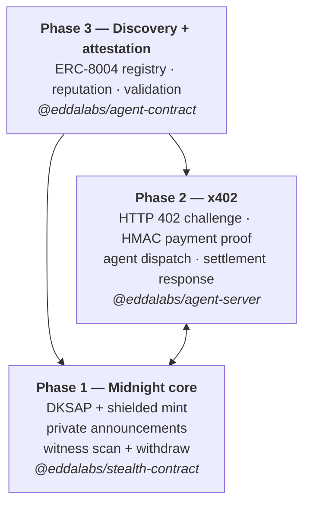
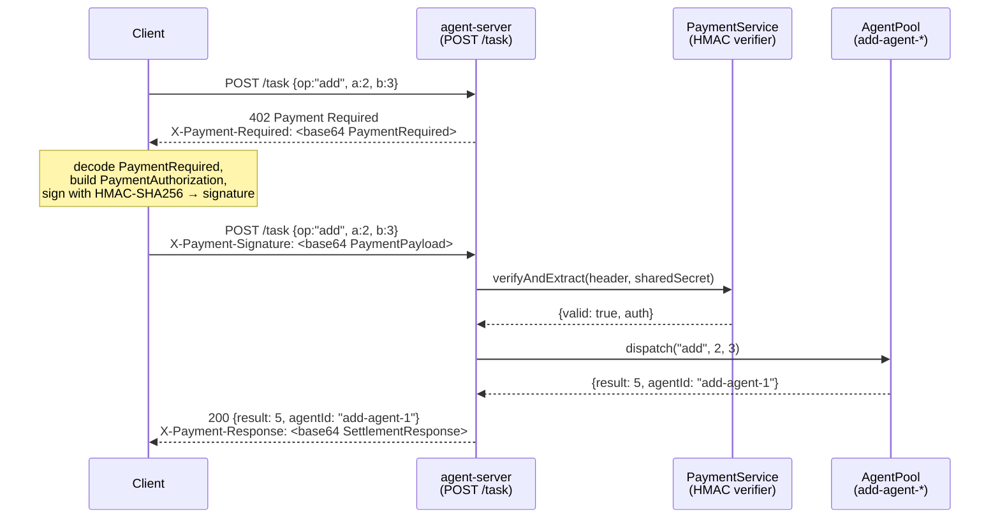

# EDDA — Midnight starter with DKSAP stealth roadmap

Starter monorepo for [Midnight Network](https://docs.midnight.network) dapps: **shielded Compact contracts**, **React + Vite**, and a **DKSAP-style stealth address** stack planned end-to-end on Midnight (private announcements, witness-based scanning, Zswap). The **counter** template proves deploy/prove/indexer flow; **stealth** extends the same package pattern with crypto and a UI demo.

**Live demo (counter template):** [counter.nebula.builders](https://counter.nebula.builders)

---

## Technical architecture (planned)

Work is intentionally ordered so mocks and APIs line up with future on-chain behavior.

### Roadmap phases

| Phase | Scope | Status |
| ----- | ----- | ------ |
| **1 — Core** | Keys, DKSAP derivation, shielded payment intent, private announcements, scanning, withdrawal | Owned by `@eddalabs/stealth-contract` (TypeScript reference + Compact) in the same way `@eddalabs/counter-contract` owns the counter circuit and managed artifacts |
| **2 — Commerce** | [x402](https://www.x402.org)-style flows: challenge (402), payment proof, resource unlock | **Implemented** — `@eddalabs/agent-server` exposes `POST /task`, issues HTTP 402 challenges, verifies HMAC-SHA256 proofs, dispatches to an in-memory agent pool |
| **3 — Ecosystem** | [ERC-8004](https://eips.ethereum.org/EIPS/eip-8004) Identity, Reputation, and Validation registries for trustless agent discovery | **Ported** — `@eddalabs/agent-contract` implements all three registries as Compact circuits + TypeScript SDK |

**Build order:** ship Phase 1 first (crypto, Compact evolution, witnesses, DUST for fees), then wire x402, then discovery.

### Layer view



### x402 Agent Marketplace flow (Phase 2)

An external client pays per task via the HTTP 402 protocol. Payment proof is an HMAC-SHA256 over a canonical payload (Midnight DUST units); a pool of idle agents dispatches the work and returns the result.



**Run the demo:**

```bash
# Terminal 1 — start the server
npm run dev:agent-server

# Terminal 2 — run the client (performs the full 402 → pay → result cycle)
node agent-server/scripts/demo-client.mjs
```

### Agent metadata (ERC-8004 agentURI)

Each agent registered in the Identity Registry points to a JSON metadata document stored on IPFS. The SHA-256 of its canonical form is committed on-chain as `uriHash`.

**Schema** (`AgentMetadata` in `@eddalabs/agent-contract`):

| Field | Required | Description |
|---|---|---|
| `type` | ✓ | `"https://eips.ethereum.org/EIPS/eip-8004#registration-v1"` |
| `name` | ✓ | Human-readable agent name |
| `description` | ✓ | What it does, pricing, interaction notes |
| `active` | ✓ | Whether the agent is currently accepting work |
| `x402Support` | ✓ | Whether the agent accepts x402 payment-gated requests |
| `services` | ✓ | Array of `{name, endpoint, version}` — `"web"`, `"A2A"`, `"MCP"`, etc. |
| `image` | — | URL to agent avatar |
| `registrations` | — | Cross-chain registry references `{chain, registry, agentId}` |
| `supportedTrust` | — | `"reputation"` \| `"crypto-economic"` \| `"tee-attestation"` |

**Demo agent metadata (Add Agent) — pinned to IPFS:**

- **CID:** `QmdJr4hbTAVwx1LtBVGuwyjf8kQVVFGSRbPBvby5nB7kFp`
- **agentURI:** `ipfs://QmdJr4hbTAVwx1LtBVGuwyjf8kQVVFGSRbPBvby5nB7kFp`
- **Gateway:** [View on Pinata](https://gateway.pinata.cloud/ipfs/QmdJr4hbTAVwx1LtBVGuwyjf8kQVVFGSRbPBvby5nB7kFp)

To pin your own agent metadata:
```bash
node agent-server/scripts/pin-metadata.mjs
# prints CID + agentURI + gateway URL
```

The returned `agentURI` is passed to `IdentityRegistry.register()` and its hash is stored on-chain.


- **Receiver:** spending and viewing secrets `p_spend`, `p_view`; public points `P_spend`, `P_view` published (e.g. registry).
- **Sender:** ephemeral scalar `r`, `R = r·G`; shared with viewing key; `S = r·P_view`; `h = SHA256(compress(S))`; **view tag** `h[0]`; one-time spend point `P_stealth = h_scalar·G + P_spend`; address derived from `P_stealth` (see [ERC-5564](https://eips.ethereum.org/EIPS/eip-5564) ecosystem alignment).
- **Midnight:** amounts, announcement payloads, and graph leakage belong in **shielded / private state**; **witnesses** support efficient receive-side checks; **DUST** for fees.

Transparent L1 stealth improves the *label*; Midnight is where **value and metadata** stay appropriately private.

### Target user journey

```
Setup → Discover → Derive stealth → Shielded pay → Scan → Withdraw → Attest
```

- **Discover / attest:** Phase 3.
- **x402:** between discovery and settlement where APIs gate resources.
- **Scan:** witness-assisted or client-side scan over private announcement state (design evolves with Compact).

### Monorepo mapping

| Package | Purpose |
| ------- | ------- |
| `counter-contract` | Reference Compact module + managed bindings; blueprint for `stealth-contract` CI and artifacts |
| `counter-cli` | Deploy / join / CLI flows for local and preview networks |
| `stealth-contract` | DKSAP crypto (`@noble/secp256k1`, `ethers`), services, tests, Compact sources under `contracts/` / `src/*.compact` → `managed/` as circuits mature |
| `agent-contract` | ERC-8004 port — Identity, Reputation, and Validation registries as Compact circuits + TypeScript SDK; `AgentMetadata` schema + `hashAgentMetadata` for IPFS-pinned agent URIs |
| `agent-server` | x402 agent marketplace — HTTP 402 payment gate, HMAC-SHA256 proof verification, in-memory agent pool dispatching `add(a,b)` tasks; `pin-metadata.mjs` script publishes `AgentMetadata` to IPFS via Pinata |
| `frontend-vite-react` | React app: `/counter` uses counter SDK; `/stealth` uses stealth SDK + `@eddalabs/stealth-contract` for client crypto; copies ZK artifacts via `scripts/copy-contract-keys.mjs` |

**Principle:** no third-party stealth npm crate — curve work stays in-repo for auditability and Midnight alignment.

### Implementation status (high level)

- **Counter:** Template parity with Midnight quickstart (deploy, prove, private state).
- **Stealth:** Client DKSAP, mock announcement queue, receive scan UI, stealth contract artifact layout mirroring counter; Compact compilation path exists and will grow with real shielded announcement logic.
- **Agent (ERC-8004):** All three registries ported — Identity (register, URI, metadata, wallet), Reputation (feedback, revocation, responses, summaries), Validation (requests, scored responses, validator summaries). `AgentMetadata` TypeScript schema + `hashAgentMetadata` helper for IPFS-pinned agent URIs. Compact circuits compilable today; production ownership proofs and on-chain aggregation documented in `contracts/` design sketches.
- **x402 Agent Marketplace:** `agent-server` implements the full HTTP 402 flow — challenge, HMAC-SHA256 payment proof verification, in-memory agent pool, and settlement response. Demo client at `agent-server/scripts/demo-client.mjs`.
- **x402 / discovery integration:** Planned deeper integration (Midnight on-chain settlement, full discovery via Phase 3 registries).

Internal design notes for contributors live under `.cursor/skills/midnight-architect/` (checklists and reference markdown).

---

## Prerequisites

- [Node.js](https://nodejs.org/) (v18+ per `engines`; v23+ recommended where noted upstream) and npm
- [Docker](https://docs.docker.com/get-docker/)
- [Git LFS](https://git-lfs.com/)
- [Compact](https://docs.midnight.network/relnotes/compact-tools) (Midnight developer toolchain)
- [Lace](https://chromewebstore.google.com/detail/hgeekaiplokcnmakghbdfbgnlfheichg) (browser wallet) for preview network
- [Faucet](https://faucet.preview.midnight.network/) for test funds

## Setup

### Git LFS

```bash
git lfs install
```

### Compact tools

Follow Midnight’s install docs, then ensure a compatible compiler (e.g. `compact check` / project-pinned version).

### Install and build (workspace root)

```bash
npm install
npm run build
```

Build scripts use Node’s `fs` helpers so they run cleanly on Windows, macOS, and Linux.

### Environment

1. **`counter-cli`:** copy [`counter-cli/.env_template`](./counter-cli/.env_template) to `.env`.
2. **`frontend-vite-react`:** copy [`frontend-vite-react/.env_template`](./frontend-vite-react/.env_template) to `.env` (includes `VITE_STEALTH_CONTRACT_ADDRESS` for the stealth demo).
3. **Root `.env`** (optional): add `PINATA_API_KEY` and `PINATA_API_SECRET` to enable `pin-metadata.mjs`.

## Development

### Preview network

```bash
npm run dev:frontend
```

### x402 agent server

```bash
npm run dev:agent-server
# → http://localhost:3402
# Demo client (in another terminal):
node agent-server/scripts/demo-client.mjs
```

### Local / undeployed network

```bash
npm run setup-standalone
# then, in another terminal:
npm run dev:frontend
```

### Routes

- **`/counter`** — original counter dApp flow.
- **`/stealth`** — Stealth Pay demo (keys, derive, mock announcements, scan).

## Project structure

```
├── counter-cli/          # CLI: deploy, join, standalone setup
├── counter-contract/     # Counter Compact module + managed artifacts
├── stealth-contract/     # DKSAP + stealth Compact (template parity with counter)
├── agent-contract/       # ERC-8004 port: Identity, Reputation, Validation registries
├── agent-server/         # x402 agent marketplace: HTTP 402 gate + agent pool
└── frontend-vite-react/  # Vite + React + TanStack Router; counter + stealth SDKs
```

## Known issues

- Arm64 Docker image for the proof server may be buggy upstream; workaround: use a supported proof-server image (e.g. `bricktowers/proof-server:6.1.0-alpha.6`) per team notes.
- If `vite build` fails on `@tailwindcss/oxide` native bindings, reinstall dependencies for your platform (clean `node_modules` + lockfile-driven install).

## References

- [Midnight docs](https://docs.midnight.network) · [midnightntwrk on GitHub](https://github.com/midnightntwrk)
- [ERC-5564](https://eips.ethereum.org/EIPS/eip-5564) (stealth meta-addresses)
- [x402](https://www.x402.org) · [x402 specification v2](https://github.com/coinbase/x402/blob/main/specs/x402-specification-v2.md)
- [ERC-8004](https://eips.ethereum.org/EIPS/eip-8004) (trustless agents)
- [Pinata](https://pinata.cloud) (IPFS pinning for agent metadata)

---

<div align="center"><p>Built with care by <a href="https://eddalabs.io">Edda Labs</a></p></div>
