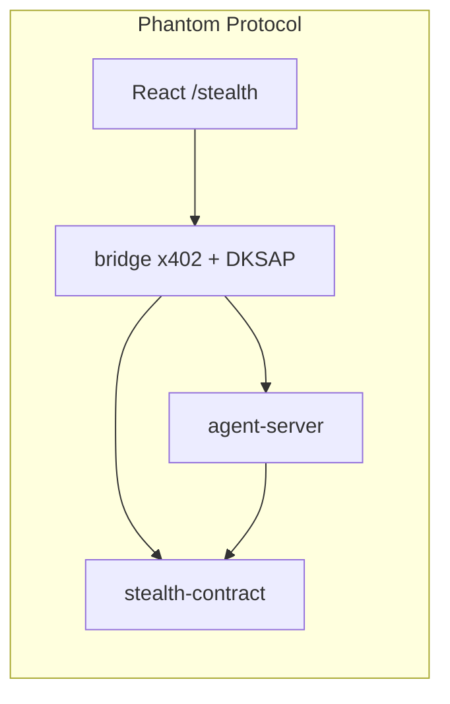

# Phantom Protocol

**Private agent-to-agent payments on Midnight Network.**

Phantom Protocol lets AI agents pay each other using stealth addresses — observers do not see who paid whom, how much, or for what. Built on Midnight’s zero-knowledge stack with **Compact smart contracts** deployable to **Preview**, **real DKSAP cryptography**, and an **x402 HTTP payment** flow with a working **browser + CLI** demo.

> **Hackathon submission** — Six ZK contracts (identity, reputation, validation, stealth key registry, stealth send, announcement log), DKSAP + HMAC commerce, and end-to-end tests against a live agent server.

---

## Quick demo (~2 minutes)

From the monorepo root (Node 18+):

```bash
npm install
```

**Terminal 1 — x402 agent marketplace**

```bash
npm run dev:agent-server
```

Leaves **`http://localhost:3402`** listening for `POST /task`.

**Terminal 2 — full stealth + x402 E2E (needs Terminal 1)**

```bash
npm run demo:phantom
```

Or manually:

```bash
cd stealth-contract && npm run test:e2e
```

**Terminal 3 — UI (optional)**

```bash
npm run dev:frontend
```

Open the app and go to **`/stealth`** for the two-panel buyer/seller flow (DKSAP + x402). **`/`** is the Phantom Protocol home hub.

**One-liner checks**

| Command | What it does |
| -------- | ------------- |
| `node agent-server/scripts/demo-client.mjs` | Minimal x402 client (no stealth) |
| `npm run deploy-all` | Deploy all six Compact contracts from `scripts/deploy-all.ts` (wallet + `.env` required) |

Shared HMAC demo secret matches the server default: `midnight-demo-secret` (override with `AGENT_SERVER_SECRET` / `VITE_X402_SECRET`).

---

## What’s in the box

| Layer | Package | Notes |
| ----- | -------- | ----- |
| **Stealth + announcements** | `@eddalabs/stealth-contract` | Compact module + DKSAP (`src/crypto`), x402 bridge (`src/bridge`), services, Vitest |
| **Agent identity / trust** | `@eddalabs/agent-contract` | Identity, Reputation, Validation registries (ERC-8004–style) |
| **x402 marketplace** | `@eddalabs/agent-server` | `POST /task`, HTTP 402, HMAC-SHA256 proofs, agent pool |
| **CLI / reference** | `counter-contract`, `counter-cli` | Midnight template parity |
| **Web app** | `@eddalabs/frontend-vite-react` | `/counter`, `/stealth`, wallet UI |

Internal npm scope stays **`@eddalabs/*`** for workspace imports; **Phantom Protocol** is the product name in docs and UI.

---

## Architecture snapshot



- **Phase 1 — Core:** one-time stealth addresses, announcements, local/chain-aligned types.  
- **Phase 2 — Commerce:** x402 challenge → `PaymentAuthorization` → HMAC → paid `POST /task`.  
- **Phase 3 — Discovery:** registries in `@eddalabs/agent-contract` for agent metadata and attestations.

---

## Prerequisites

- **Node.js** 18+ (see root `engines`)
- **npm** (workspaces)
- **Git LFS** (contract ZK artifacts)
- **Compact** toolchain (when compiling `.compact` locally)
- **Lace** + **Preview faucet** if you deploy or pay real fees on Preview

## Setup

```bash
git lfs install
npm install
npm run build
```

**Env templates**

- `counter-cli/.env_template` → `counter-cli/.env`
- `frontend-vite-react/.env_template` → `frontend-vite-react/.env` (stealth addresses, `VITE_AGENT_SERVER_URL`, etc.)
- `scripts/.env.template` → `scripts/.env` for `deploy-all`

**IPFS agent metadata (optional):** root `.env` with `PINATA_API_KEY` and `PINATA_API_SECRET` for `agent-server/scripts/pin-metadata.mjs`.

## Deploying the six contracts

See **`DEPLOYMENT_PROCEDURE.md`** (Vercel / app hosting) and run from root:

```bash
npx tsx scripts/deploy-all.ts
```

Addresses are printed and saved to `scripts/deployments.json`.

## Project layout

```
├── agent-contract/       # Identity, Reputation, Validation (Compact)
├── agent-server/         # x402 HTTP gate + agent pool
├── agent-cli/            # Agent registry deploy helpers
├── counter-contract/     # Reference Compact + managed artifacts
├── counter-cli/          # Counter deploy / preview CLI
├── stealth-contract/     # DKSAP, bridge, stealth Compact
├── scripts/              # deploy-all, demo-phantom, env templates
└── frontend-vite-react/  # Vite + React + TanStack Router
```

## References

- [Midnight docs](https://docs.midnight.network)  
- [x402](https://www.x402.org)  
- [ERC-5564](https://eips.ethereum.org/EIPS/eip-5564) (stealth meta-addresses)  
- [ERC-8004](https://eips.ethereum.org/EIPS/eip-8004) (agents)

---

<div align="center"><p><strong>Phantom Protocol</strong> · <a href="https://eddalabs.io">Edda Labs</a></p></div>
